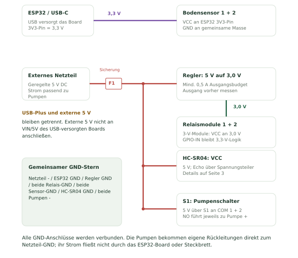
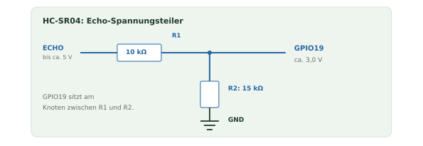
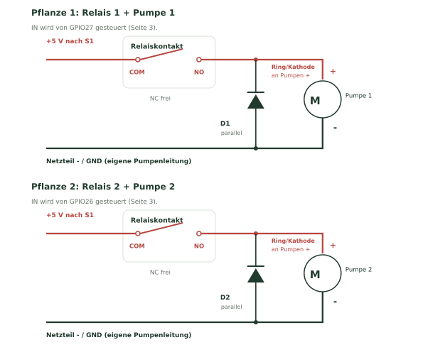

# ESP Smart Irrigation V4: Verkabelung und Inbetriebnahme

Dieser Plan passt zur V4-Vorbelegung für zwei Pflanzen: diymore ESP32 NodeMCU
mit ESP-WROOM-32, USB-C/CH340, zwei kapazitive analoge Bodensensoren,
zwei 5-V-DC-Pumpen, zwei angebotene AYWHP-3-V-Einkanalrelais mit HIGH-Trigger
und ein gemeinsamer Tank mit HC-SR04.

**Die Anleitung ist mit der Firmware abgeglichen; der tatsächliche Aufbau ist noch nicht geprüft.**
Relais-Modulversorgung und Anschlüsse am realen Modul bzw. dessen Herstellerunterlagen
bestätigen. Das Produktbild ersetzt kein Modulschaltbild. Die Bodensensoren müssen mit
3,3 V funktionieren und einen Analogausgang von höchstens 3,3 V liefern.
Die genauen Sensor-Modelle und Pumpenströme fehlen noch; davon hängen Netzteil,
Sicherung, Leitungen und Freilaufdioden ab.

## 1. Bauteile und Hilfsmittel

| Teil | Anzahl | Zweck / Auswahl |
|---|---:|---|
| ESP32 NodeMCU / WROOM mit USB-C | 1 | Board laut deinem Produktbild |
| Kapazitiver analoger Bodensensor, 3,3-V-kompatibel | 2 | Je Pflanze ein Sensor mit AO/AOUT/SIG |
| 5-V-DC-Pumpe | 2 | Je Pflanze eine Pumpe; gemäß Hersteller montieren |
| AYWHP-3-V-Relaismodul, HIGH-Trigger | 2 | Mit VCC/GND/IN und COM/NO/NC; Angaben bestätigen |
| HC-SR04 | 1 | Trocken oberhalb der Wasserfläche |
| Geregeltes externes 5-V-DC-Netzteil | 1 | Beide Pumpen-Anlaufströme plus etwa 0,5 A Reserve berücksichtigen |
| Separater 5-V-auf-3,0-V-Regler | 1 | Mindestens 0,5 A Ausgangsbudget; Regler für diese Spannungen geeignet |
| 10-kΩ-Widerstand, 1 % | 3 | Zwei Relais-Pull-downs und R1 für Echo |
| 15-kΩ-Widerstand, 1 % | 1 | R2 für Echo |
| Freilaufdiode passend zur Pumpe | 2 | Sperrspannung mindestens 20 V; Strom/Impulse passend zum maximalen Pumpenstrom |
| 100-nF-Keramikkondensator | 3 | Je Pumpe einer, einer am HC-SR04 |
| Elko 470-1000 µF, mindestens 10 V | 1 | Über externe 5 V / GND am Verteiler |
| Elko 10 µF, mindestens 10 V | 1 | Über HC-SR04 VCC / GND |
| Regler-Kondensatoren | Nach Datenblatt | Ein-/Ausgangsbeschaltung des gewählten Reglers |
| DC-Sicherung F1 mit Halter | 1 | Nach Strom, Anlaufstrom und Leitungen wählen; kein pauschaler Amperewert |
| Pumpenschalter / abziehbare Pumpen-Plus-Verbindung S1 | 1 | Physische Trennung der 5 V zu beiden COM-Kontakten |
| Klemmen, geeignete Leitungen, Schläuche, Gehäuse | Nach Aufbau | Pumpenstrom über feste Klemmen; Elektronik und Anschlüsse trocken |
| Multimeter und USB-C-Datenkabel | Je 1 | Versorgung und Relaiskontakte prüfen, MicroPython installieren |

Steckbrett und Dupontleitungen nur für kleine Sensor-/Steuerströme einsetzen.
Pumpen benötigen eigene, ausreichend dimensionierte Versorgungs- und Rückleitungen.
Diese Anleitung behandelt die DC-Seite eines fertigen Netzteils.

## 2. GPIOs und Anschlüsse

Nach GPIO-Aufdruck verdrahten, nicht nach Position auf der Stiftleiste.
Ein Aufdruck `34` bedeutet GPIO34. Zeichnungen sind symbolisch; unterschiedliche
NodeMCU-Platinen können eine andere Pinreihenfolge haben.

| Bauteil | Anschluss | Verbinden mit |
|---|---|---|
| Bodensensor 1 | VCC / + | ESP32 3V3 |
| Bodensensor 1 | GND / - | Gemeinsamer GND |
| Bodensensor 1 | AO / AOUT / SIG | GPIO34 |
| Bodensensor 2 | VCC / + | ESP32 3V3 |
| Bodensensor 2 | GND / - | Gemeinsamer GND |
| Bodensensor 2 | AO / AOUT / SIG | GPIO35 |
| Relaismodul 1 | VCC | Externe geregelte 3,0 V, sofern für das tatsächliche 3-V-Modul bestätigt |
| Relaismodul 1 | GND | Gemeinsamer GND |
| Relaismodul 1 | IN | GPIO27; zusätzlich 10 kΩ nach GND |
| Relaismodul 2 | VCC | Dieselbe externe 3,0-V-Schiene |
| Relaismodul 2 | GND | Gemeinsamer GND |
| Relaismodul 2 | IN | GPIO26; zusätzlich eigener 10 kΩ nach GND |
| HC-SR04 | VCC | Externe 5 V |
| HC-SR04 | GND | Gemeinsamer GND |
| HC-SR04 | TRIG | GPIO18 |
| HC-SR04 | ECHO | R1 = 10 kΩ, dann Knoten; Knoten an GPIO19, R2 = 15 kΩ vom Knoten nach GND |

GPIO34/35 sind Analogeingänge des ADC1. Ein eventuell vorhandener DO-Anschluss
am Bodensensor wird nicht benutzt. Nur die Sensor-Messfläche in Erde stecken;
Elektronik und Steckverbinder bleiben trocken.

V4 nutzt `board: esp32`, Sensorpins 34/35, Pumpenpins 27/26 sowie
`trigger_pin: 18`, `echo_pin: 19`. „Pflanze 1“ hat die interne Kanal-ID 0,
„Pflanze 2“ die ID 1. Die Freigabe `hardware_confirmed` bleibt zunächst false.

## 3. Stromversorgung und gemeinsame Masse



1. ESP32 über einen eigenen USB-C-Anschluss versorgen: PC zur Einrichtung,
   später ein geeignetes USB-Netzteil.
2. Vom externen 5-V-Netzteil über F1 an einen 5-V-Verteiler gehen.
3. Dieser Verteiler versorgt HC-SR04 und den separaten Relaisregler.
4. Den Regler vor Anschließen der Relais auf **3,0 V** einstellen und messen.
   Beide Relais-VCC kommen an diesen Ausgang. Das ist der Vorschlag für die
   angebotene 3-V-Ausführung; eine andere tatsächliche Modulangabe hat Vorrang.
5. Eine weitere 5-V-Leitung über S1 zu COM von Relais 1 und COM von Relais 2 führen.
   S1 trennt ausschließlich die Pumpen-Plusversorgung; Sensoren und Relaisversorgung
   bleiben damit für die Prüfung verfügbar.
6. Die Bodensensoren bekommen VCC vom **3V3-Pin des ESP32**.

**USB-Plus und externe 5 V bleiben getrennt.** Externe 5 V in diesem Aufbau
nicht an den VIN-/5V-Pin des über USB versorgten Boards anschließen.
Die Relais-VCC kommen an den externen Regler, nicht an ESP32 3V3 und nicht an Pumpen-5V.

Folgende Masseanschlüsse miteinander verbinden:

- Minus des externen Netzteils,
- ESP32 GND,
- Regler-Masse (IN-/OUT- gemäß Reglerbeschriftung),
- GND beider Relaismodule,
- GND beider Bodensensoren,
- HC-SR04 GND,
- Minus beider Pumpen und Masseanschlüsse der Schutzbeschaltung.

Die Pumpen-Minusleitungen führen jeweils direkt zum GND-Verteiler beim Netzteil.
Pumpenstrom darf nicht durch die ESP32-Platine oder Steckbrettschienen fließen.
Die Optokoppler der Relaismodule ergeben bei dieser gemeinsamen Masse keine
vollständige galvanische Trennung der Steuerung.

Zuerst ESP32-USB einschalten, danach externe 5 V. Zum Ausschalten zuerst
das externe Netzteil trennen, dann USB; extern versorgte Signale sollen das
ausgeschaltete ESP32-Board nicht über Eingänge speisen.

## 4. HC-SR04: Echo richtig herunterteilen



**ECHO nicht direkt an GPIO19 anschließen.** Der Standard-HC-SR04 wird mit
5 V versorgt und sein Ausgang arbeitet mit 5-V-Logik.

1. HC-SR04 ECHO an **R1 = 10 kΩ** anschließen.
2. Das andere Ende von R1 ist der **Knoten**.
3. Den Knoten mit **GPIO19** verbinden.
4. **R2 = 15 kΩ** zwischen diesem Knoten und GND anschließen.
5. HC-SR04 TRIG direkt mit GPIO18 verbinden.

Bei einem 5-V-HIGH am Echo ergeben sich rechnerisch
`5 V × 15 / (10 + 15) = 3,0 V` am GPIO19. R1 und R2 nicht vertauschen.
Ein geeigneter Pegelwandler ist eine Alternative zum Spannungsteiler.

Der Sensor bleibt trocken, mit freiem Blick senkrecht auf die Wasserfläche.
Beim vollen Tank mindestens den 2-cm-Nahbereich freihalten; praktisch mehr
Abstand vorsehen. Wände, kleine Gefäße, Schaum und Kondenswasser können
die Messung stören. Vor Pumpenfreigabe im tatsächlichen Behälter prüfen.

## 5. Relaiskontakte und Pumpen



| Anschluss | Relais / Pumpe 1 | Relais / Pumpe 2 |
|---|---|---|
| COM | +5 V nach F1 und S1 | +5 V nach F1 und S1 |
| NO | Plus der Pumpe 1 | Plus der Pumpe 2 |
| NC | Frei lassen | Frei lassen |
| Pumpen-Minus | Direkt zum Netzteil-GND | Direkt zum Netzteil-GND |
| Dioden-Kathode (Ring) | Pumpe 1 Plus / NO | Pumpe 2 Plus / NO |
| Dioden-Anode | Pumpe 1 Minus / GND | Pumpe 2 Minus / GND |

COM und NO sind der im ausgeschalteten Zustand offene Kontakt.
**Keine feste Links-/Mitte-/Rechts-Reihenfolge annehmen:** tatsächlichen Aufdruck
lesen und Kontaktfunktion mit dem Multimeter überprüfen.

Die Diode liegt **parallel** zur Pumpe, nicht in der Plusleitung.
Ring/Kathode immer an Pumpen-Plus, Anode an Pumpen-Minus.
Für die zwei unidirektional betriebenen DC-Pumpen Strom-/Impulsbelastbarkeit
passend zum maximalen Pumpenstrom und mindestens 20 V Sperrspannung wählen.

Als Entstörungsaufbau vorsehen:

- 100 nF Keramik direkt zwischen + und - jeder Pumpe,
- 470-1000 µF / mindestens 10 V am 5-V-Verteiler (Elko-Plus an 5 V, Minus an GND),
- 100 nF und 10 µF direkt über HC-SR04 VCC/GND,
- Ein-/Ausgangskondensatoren am Regler gemäß dessen Datenblatt.

Kondensatoren ersetzen kein ausreichend starkes Netzteil. Leitungen kurz halten.
Netzteil konservativ für beide Pumpen-Anlaufströme plus etwa 0,5 A Reserve auswählen.
F1 und S1 anhand DC-Strom, Anlaufstrom und zulässiger Leiterbelastung dimensionieren.
Eine konkrete Sicherungs-Amperezahl benötigt erst die Pumpenangaben.
Die „10 A“-Beschriftung am Relais ist kein Maß für den Pumpenbedarf.

## 6. Zusammenbauen und Relais prüfen

1. USB und externes Netzteil abziehen. Regler getrennt einstellen und messen,
   anschließend wieder ausschalten.
2. GND-Verteiler, F1 und S1 aufbauen. **S1 offen lassen**, Pumpen-Plus ist getrennt.
3. Bodensensoren und HC-SR04 einschließlich Spannungsteiler anschließen.
4. Relais-VCC/GND/IN anschließen. Je IN einen eigenen 10-kΩ-Widerstand nach GND:
   GPIO27/IN1/10 kΩ/GND sowie GPIO26/IN2/10 kΩ/GND.
5. Pumpenkreise, Freilaufdioden und Entstörung gemäß Plan aufbauen.
6. Kurzschlüsse, Verpolung, lose Litzen und vertauschte Klemmen stromlos prüfen.
7. Zuerst ESP32-USB, danach externe 5 V einschalten; S1 bleibt offen.
   5 V, 3,0 V und 3,3 V gegen GND messen. Bei Abweichung abschalten.
8. Relaiskontakte ohne laufende Bewässerungssoftware testen.

Auf einem frisch mit MicroPython geflashten Board im USB-REPL:

```python
from machine import Pin
from time import sleep

r1 = Pin(27, Pin.OUT, value=0)
r2 = Pin(26, Pin.OUT, value=0)
for r in (r1, r2):
    try:
        r.value(1)
        sleep(1)
    finally:
        r.value(0)
```

Mit dem Multimeter den von S1 getrennten Kontakt prüfen: bei LOW ist COM-NO
offen, bei HIGH geschlossen. Der Test schaltet jedes Relais eine Sekunde ein.
Je nach Messgerät kann für die Beobachtung ohne Pumpenversorgung länger geprüft werden.
Nur LED oder Klick reichen als Kontaktprüfung nicht aus.

Anschließend Reset und USB-Neustart mit weiterhin getrenntem Pumpen-Plus prüfen.
Der COM-NO-Kontakt darf beim Start nicht schließen. Der externe Pull-down hält
IN auch dann auf LOW, wenn der GPIO noch nicht als Ausgang konfiguriert ist.

Falls LOW einschaltet oder ein Relais beim Reset anzieht: S1 offen lassen,
Modulbeschaltung, Pull-down und tatsächliche Triggerlogik korrigieren.
Die HIGH-Vorbelegung entspricht `active_low: false`; eine tatsächlich andere
Logik benötigt auch eine andere passende elektrische Ruhelage.
`hardware_confirmed` erst nach erfolgreicher Prüfung freigeben.

## 7. V4 installieren und Messwerte kalibrieren

V4-USB-Installation steht in [rebuild/README.md](../README.md).
Pumpenversorgung bei Installation/Uploads physisch getrennt lassen.
Danach mit `Irrigation-xxxxxx` verbinden und `http://192.168.4.1` öffnen.

1. **Hardware:** ESP32 / WROOM, GPIOs aus der Tabelle und Relais „HIGH“ wählen.
   Nur geprüfte Kanäle bestätigen. Automatik bleibt aus.
2. **Tank:** Abstände von der Sensorfläche zur Wasseroberfläche messen.
   `Abstand voll < Abstand Wiederfreigabe < Abstand Reserve <= Abstand leer`.
   Reserve so setzen, dass die Ansaugung noch Wasser hat. Bekannte Literstände
   als Abstand/Liter-Punkte erfassen; unregelmäßige Behälter brauchen mehrere Punkte.
3. **Speichern:** Hardware und Tank zuerst speichern; Neustart und Startpause abwarten.
4. **Bodensensoren:** Pro Pflanze in trockener Referenzerde und anschließend gut
   feuchter, abgetropfter Erde messen; Werte im Assistenten übernehmen.
   Keine Sensor-Elektronik eintauchen. Werte sollen stabil und deutlich verschieden sein.
5. **Pumpen:** Laut Hersteller montieren, Ansaugung mit Wasser versorgen.
   Nur ausdrücklich dafür geeignete Tauchpumpen untertauchen. Ausläufe in Messbecher führen.
   Erst jetzt S1 schließen. Nach Tankfreigabe/Startpause kurzen Kalibrierlauf von
   0,5-5 Sekunden starten. Fördermenge `ml/s = gesammelte ml / Laufzeit` eintragen.
   Mit endgültigen Schläuchen und Höhen wiederholen.
6. **Abschaltung:** Kleine Portion je Kanal unter Beobachtung testen.
   „Alles stoppen“ muss beide Pumpen ausschalten. Tankreserve ohne Trockenlauf prüfen.
   Beim Boot bleiben Pumpen aus; Automatik während dieser Tests ausgeschaltet lassen.
7. **Automatik:** Erst nach bestandenen Tests Portionen, Einwirkzeit und Limits passend
   zur jeweiligen Pflanze setzen und Automatik aktivieren.

Ein Kalibrierlauf reserviert vorsorglich das gesamte Zykluslimit im 24-h-Budget.
Die berechneten Wassermengen basieren auf Laufzeit und Fördermenge; sie werden
nicht mit einem Durchflusssensor gemessen. Nach dem Aktivieren der Automatik darf
nach der Startpause bei trockenem Boden regulär eine neue Bewässerung beginnen.

Tank möglichst unterhalb der Ausläufe halten und freie Ausläufe verwenden.
Bei Siphonwirkung eine geeignete Belüftung/Anti-Siphon-Lösung einsetzen:
Ein abgeschalteter Pumpenmotor unterbricht einen Siphon nicht automatisch.

## 8. Fehlersuche

| Problem | Prüfen |
|---|---|
| Pumpe läuft beim Start | S1 öffnen; COM/NO statt NC, Triggerlogik und Pull-down prüfen |
| Relais klickt, Pumpe steht | 5 V hinter S1, F1, COM/NO, Pumpenpolarität und Rückleitung |
| ESP32 startet beim Pumpenlauf neu | Netzteil/Anlaufstrom, Leitungen, GND-Stern, Dioden und Entstörung |
| Ultraschallwert fehlt oder springt | 5 V, TRIG/ECHO, Teilerwerte, Tankgeometrie, Schaum/Kondenswasser |
| Bodenwert 0/4095/instabil | Sensorversorgung, AO statt DO, GPIO34/35, 3,3-V-Kompatibilität |
| Pumpe wird softwareseitig gesperrt | Hardwarebestätigung, Kalibrierung, Tankreserve, Startpause, Sperre, Budgets |

Ein abgezogener Analogsensor kann zufällig plausible Werte erzeugen und ist nicht
immer softwareseitig erkennbar. Bei notwendigen Garantien zusätzliche elektrische
Sensorüberwachung vorsehen. Die softwareseitige Abschaltung ersetzt keine Sicherung.

## Referenzen und Zuordnung

- [Espressif ESP32-Datenblatt: GPIOs und Logikpegel](https://documentation.espressif.com/esp32_datasheet_en.html)
- [ELECFREAKS HC-SR04-Datenblatt, bereitgestellt von SparkFun](https://cdn.sparkfun.com/datasheets/Sensors/Proximity/HCSR04.pdf)
- [Adafruit: HC-SR04 mit Echo-Spannungsteiler](https://learn.adafruit.com/distance-measurement-ultrasound-hcsr04/connect-the-sensor)
- [Songle SRD-Datenblatt, Herstellerdokument auf Alldatasheet](https://www.alldatasheet.com/datasheet-pdf/pdf/1132027/SONGLERELAY/SRD-03VDC-SL-C.html)
- Bauteilzuordnung: deine diymore- und AYWHP-Produktbilder (AYWHP ASIN B0DQL4SVN6).
- Firmware: [settings.py](../firmware/settings.py), [hardware_v4.py](../firmware/hardware_v4.py), [index.html](../firmware/index.html).

Regler, F1/S1, Entstörung, Echo-Teilerwerte und GND-Stern sind Vorschläge für
diesen Aufbau. Der Songle-Spulendatensatz bestätigt nicht automatisch die
Versorgung und Eingangsbeschaltung des gesamten AYWHP-Moduls.
